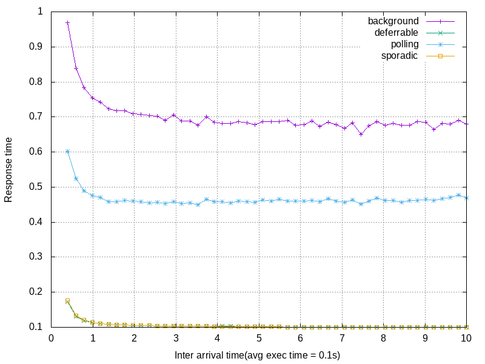
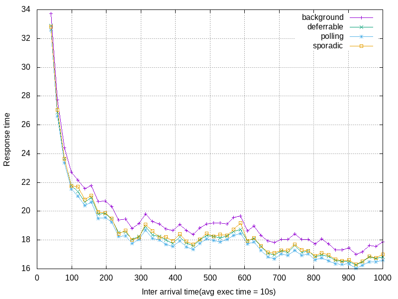
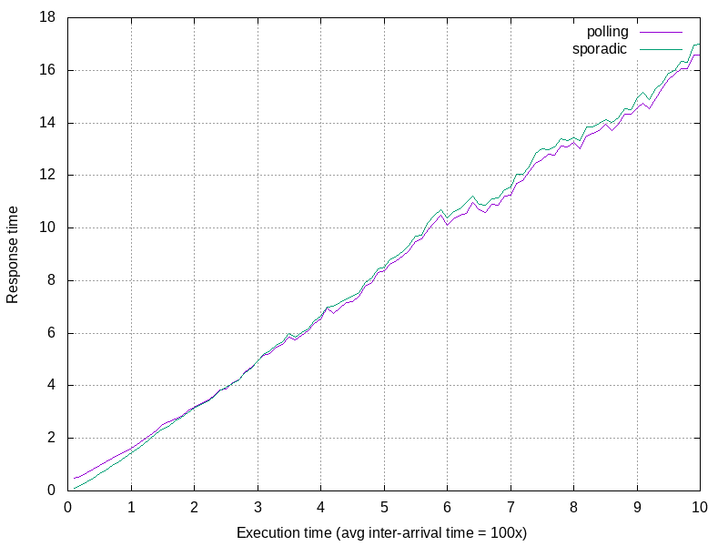

# Computer Modeling HW5
Seoul National University
Dept. of Computer Science and Engineering
2018-11940 **Seonghwan Choi**

## 1. Simulation 환경
- 시뮬레이션에는 OMNeT++을 사용하였다.
- 2개의 periodic task generator 모듈과 1개의 aperiodic task generator 모듈, 이들을 scheduling하는 scheduler 모듈과 sink 모듈로 구성되어 있다.
- 주어진 task는 아래와 같다.
  
  |task|type|e(budget)(s)|  p(s) |
  |:--:|:--:|:-------:|:--:|
  |$\tau_1$|periodic|1|4|
  |$\tau_2$|periodic|2|10|
  |$\tau_3$|aperiodic|1(other) or 5/6(deferrable)|2|

- 주어진 aperiodic task의 spec은 아래와 같다. 크게 두 가지 type(BIG/SMALL)에 대해 시뮬레이션을 수행햔다.

  |type|avg. execution time(s)|avg. inter-arrival time(s)|
  |:--:|:-------:|:--:|
  |SMALL|0.1|0.4~10|
  |BIG|10|40~1000|

- 주어진 target scheduler은 background / polling / deferrable / sporadic server이며, 모두 server idle의 상황에서 aperiodic job의 background processing이 가능하다. 

## 2. Simulation 결과
### 2.1. Small case ($T_{exec}=0.1$)
- 아래는 aperiodic task의 $T_{exec}=0.1s$ 상황에서, $T_{interval}$을 $[0.4, 10]s$의 구간 내 등간격으로 지정된 50개의 지점에서 시뮬레이션하였을 때 aperiodic task의 평균 response time의 그래프이다.
  
  

- Background server의 response time이 가장 길었으며, 그 다음으로 Polling server이 긴 response time을 보였다.
- Deferrable server($budget=5/6s$)와 Sporadic server($budget=1s$)은 거의 동일한 response time을 보였다.

### 2.2. Big case ($T_{exec}=10$)
- 아래는 aperiodic task의 $T_{exec}=10s$ 상황에서, $T_{interval}$을 $[40, 1000]s$의 구간 내 등간격으로 지정된 50개의 지점에서 시뮬레이션하였을 때 aperiodic task의 평균 response time의 그래프이다.
  
  

- Background server의 response time이 가장 길었으며, Polling server이 가장 짧은 response time을 보였다.
- Deferrable server($budget=5/6s$)와 Sporadic server($budget=1s$)은 거의 동일한 response time을 보였다.

## 3. 결과 분석
- 두 경우 모두에서, 가장 naive한 구현인 Background server가 가장 낮은 throughput을 보였다.
  - 다른 Server들은 budget을 할당하여 aperiodic job을 처리하는 데 반해, Background server은 가장 낮은 priority로 background job을 처리함에 따른 결과로 분석된다.
- Deferrable server와 Sporadic server은 두 경우 모두에서 비슷한 throughput을 보였다.
  - 두 Server에서 aperiodic job에 할당된 budget이 다름에 주목할 필요가 있다. Deferrable server의 Bundling effect로 인해, schedulability 보장을 위해 더 적은 budget을 할당하였다.
- Polling server의 경우, aperiodic job의 arrival, execution time의 scale이 달라짐에 따라 다른 Server들과 비교하였을 때 상반되는 throughput 양상을 보였다. Small scale case에서는 낮은 throughput을 보였으나, Big scale case에서는 높은 throughput을 보였다.
  - Polling server은 주기적으로 poll하였을 때 aperiodic task queue를 확인하여 job이 존재하지 않을 경우 해당 주기에서의 budget은 사라진다. 따라서 어떤 aperiodic job이 처리되기 위해, 사실상 이들이 queueing되어 있어야 한다. Deferrable 및 Sporadic server이 budget이 있을 때 즉시 이들을 처리하는 것과는 대조적이다. Polling server의 경우 이들 Server에 비해 상대적으로 queueing에 의존하는 response time 양상을 보일 것이다. Execution time scale이 작은 경우 queueing에 소요되는 시간이 execution time에 비해 큰 비율을 가지므로 response time의 성능이 다른 형태의 server들에 비해 떨어지는 것이라 분석할 수 있다.
  - 아래는 Polling / Sporadic server을 $T_{ia}$를 $T_{exec}$의 100배로 고정하고 $T_{exec}$을 $[0.1, 10]s$의 범위에서 등간격으로 100개의 지점에서 선택하여 시뮬레이션하였을 때, 평균 response time을 나타낸 그래프이다. 낮은 execution time 구간에서는 Polling server의 response time이 상대적으로 높다가, execution time이 커짐에 따라 교차되어 Polling server의 response time이 상대적으로 낮은 양상을 보인다.
    

## 4. What I've Learned
- Schedulability를 보장하며 priority에 따라 periodic job을 처리함과 동시에 aperiodic job을 다른 방식으로 처리하는 네 가지 형태의 서버 로직을 실습을 통해 학습하였다.
-  각 서버의 event handler을 디자인하는 과정에서 priority 및 state(in budget / out of budget, busy / idle 등)에 따른 handling logic을 고민해볼 수 있었다. 이 과정에서, 각 서버가 여러 state마다 갖는 invariant에 대해 고민해보며 직접 서버 로직을 구현하였다.
- OMNeT++을 사용하여 복잡한 구조의 server을 설계하는 과정에서, custom message의 정의, WATCH 등 디버깅 기능의 적절한 사용 등에 익숙해질 수 있었다.