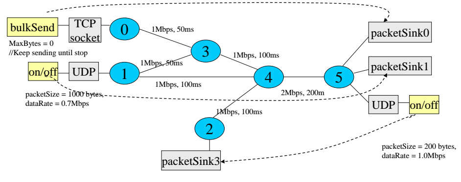
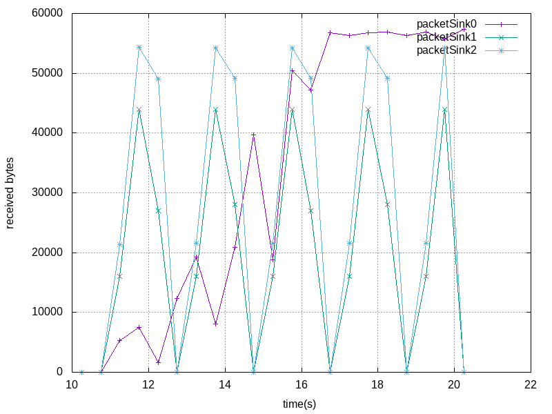
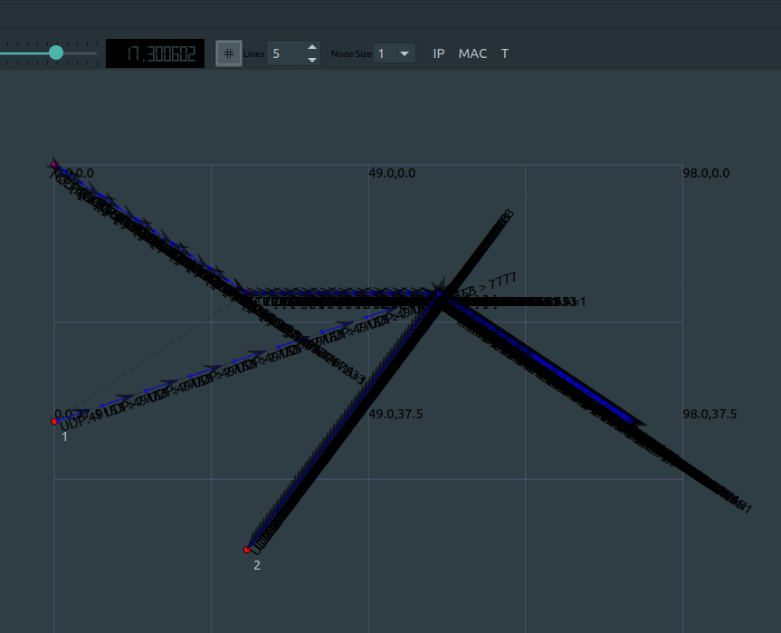
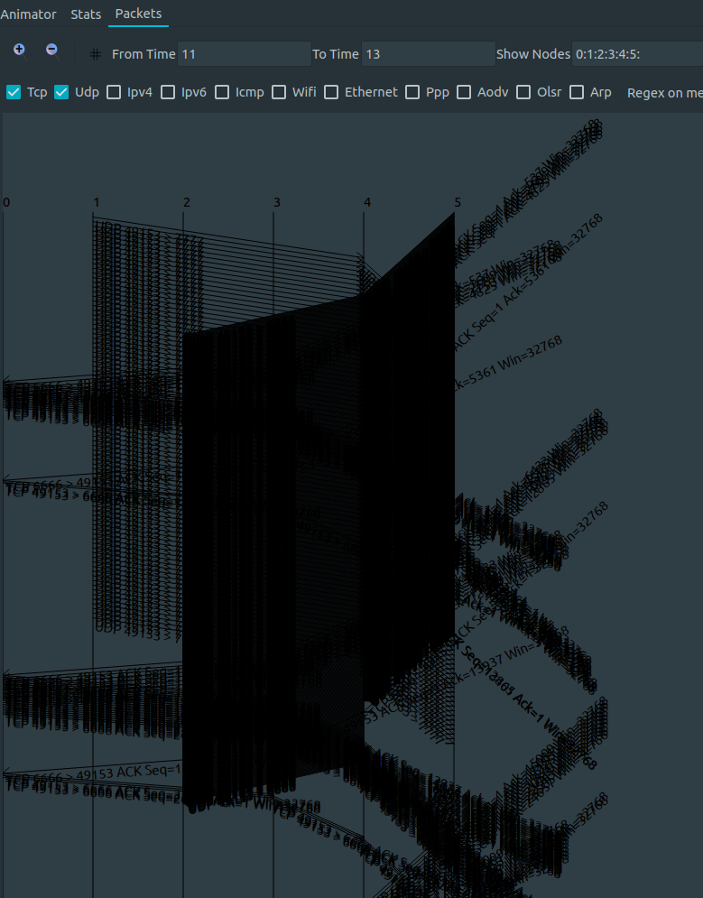
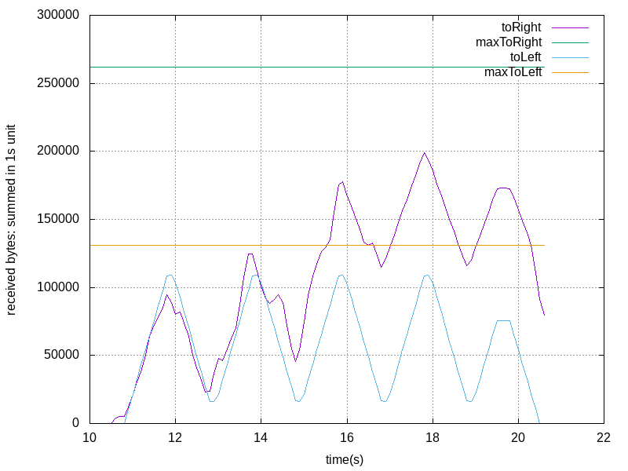

# Computer Modeling HW6
Seoul National University
Dept. of Computer Science and Engineering
2018-11940 **Seonghwan Choi**

## 1. Simulation 환경
- 시뮬레이션에는 **NS3**(ver. 3.32)을 사용하였다.
- 주어진 네트워크는 아래와 같다.

    

## 2. Simulation 결과
- 시뮬레이션 결과는 아래와 같다.
- n.25s, n.75s를 중심으로 하여, 각각 [n.0s, n.5s), [n.5s, (n+1).0s)에 도착한 byte의 합을 그래프로 나타내었다.
    
    

- UDP를 사용하는 ON/OFF Application의 패킷의 경우 특정 주기(2s)로 도착 양상이 나타난다. 이는 On duration과 Off duration이 반복됨을 보여 준다.
- TCP를 사용하는 Bulk Send Application의 패킷의 경우 TCP에서 전송 패킷의 수를 점차 늘려감에 따라 도착하는 패킷의 수가 늘어남을 확인할 수 있다.

- NetAnim을 통해 GUI로 실제 시뮬레이션이 잘 작동하는지 확인하였다.
  - 아래는 전체 Network Topology와 함께 패킷 교환을 보여주는 애니메이션이다.
  - TCP를 사용한 통신에서는 Data와 ACK 패킷이 교환되며, UDP를 사용한 통신에서는 Data 패킷만 단방향으로 전송된다.
    

  - 아래는 11~13s 구간에서 패킷 교환을 Timeline으로 나타낸 것이다.
    

- 추가적으로, 올바르게 시뮬레이션이 진행되었는지 아래의 과정을 통해 확인하였다.
  - 아래는 0.1s 간격의 시간 중심점 t에 대하여 [t-0.5, t+0.5)의 길이 1s interval에 대해 도착한 byte을 합한 것을 그래프로 나타낸 것이다.
  - 4~5 link를 통과하는 방향을 기준으로, 4~5를 통과하는 packetSink0, packetSink1로의 트래픽에 대한 도착 byte 합(toRight)과 5~4를 통과하는 packetSink2로의 트래픽에 대한 도착 byte 합(toLeft)를 그래프로 나타내었다.

    

  - packetSink0으로의 트래픽은 (0 $\rightarrow$ 3 $\rightarrow$ 4 $\rightarrow$ 5) 노드를 통과한다.
  - packetSink1로의 트래픽은 (1 $\rightarrow$ 4 $\rightarrow$ 5) 노드를 통과한다.
  - packetSink2로의 트래픽은 (5 $\rightarrow$ 4 $\rightarrow$ 2) 노드를 통과한다.
  - NS3에서 Point to Point 네트워크의 DataRate은 각 방향에 대해 정의됨을 확인하였다.
  - 따라서 packetSink0, packetSink1로의 트래픽은 4~5 link를, packetSink2로의 트래픽은 4~2 link를 Bottleneck link로 갖는다(packetSink2로의 트래픽과 packetSink0으로의 패킷에 대한 ACK 트래픽은 모두 5~4 link를 통과하지만, 5~4, 4~2 link의 DataRate 차이에 비해 ACK 트래픽이 갖는 오버헤드는 미미하다).
  - toLeft의 초당 max received bytes는 헤더의 오버헤드를 무시했을 떄, $1Mb=2^{17}B$로 계산된다(maxToLeft).
  - toRight의 초당 max received bytes은 헤더의 오버헤드를 무시했을 때, $2Mb=2^{18}B$로 계산된다(maxToRight).
  - toLeft, toRight 그래프 모두가 이 상한값을 넘지 않았다(각 프로토콜 별 Header의 크기 등을 고려한다면 더 엄밀한 상한값을 구할 수 있다. 예를 들어, toLeft의 max received bytes는 UDP 헤더 8B, IPv4 헤더 20B를 고려하여 $2^{18} \times \frac{200}{228} B$의 상한을 구할 수 있다).

## 3. What I've Learned
- NS3을 통해 간단한 예제를 실습해 보며, User의 관점에서 시뮬레이션 툴을 활용해 보았다.
- NS3가 제공하는 네트워크 통신의 계층 구조를 직접 구현을 통해 학습하였다.
- NS3에서 제공하는 시각화 기능, Helper function 등에 익숙해질 수 있었다.
- 각 프로토콜 별 통신의 형태를 시뮬레이션을 통해 확인하였다.
- 주어진 DataRate에서 Bottleneck link에 대해 고민해 보고, 이론값과 실제 시뮬레이션 결과를 간단한 계산을 통해 비교하였다.